# Lab9web_php_

<b>Nama	: Hidayat Tulloh

NIM		: 312110110

Kelas		: TI.21.B.1

Matakuliah	: Pemrograman Web</b>
1.	Menjalankan mysql server dengan aplikasi xampp, kemudian start apache dan mysql.
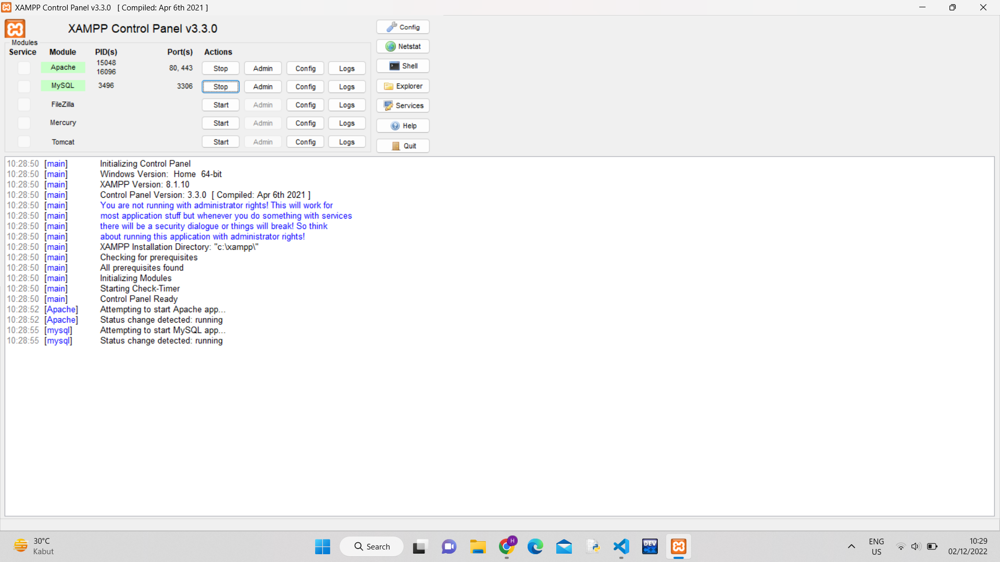 

2. Setelah itu uji coba gunakan URL :
```
http://localhost/lab9_php_modular/
```
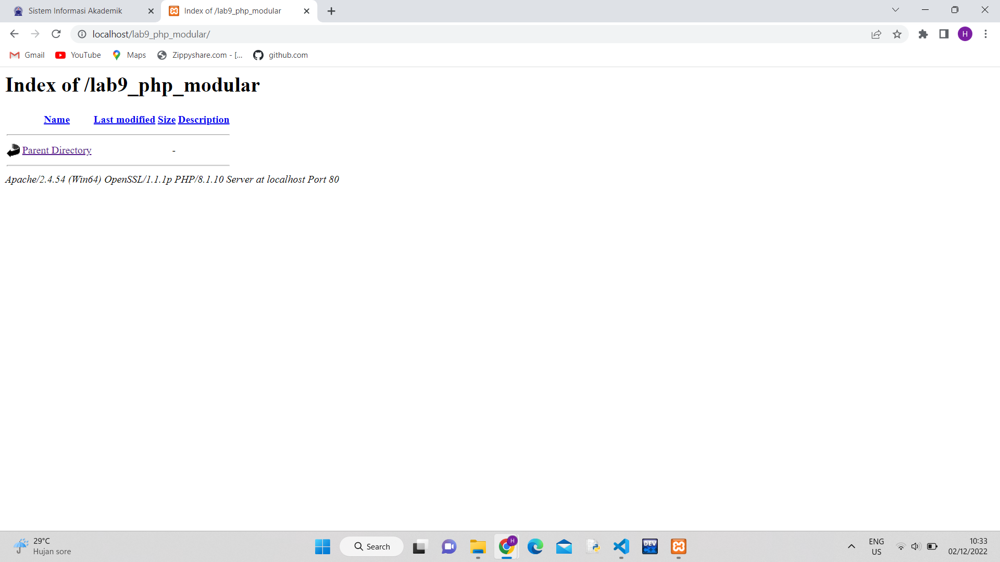<br>

3.<b> Membuat file baru dengan nama `header.php`
Membuat file baru dengan nama `footer.php`
Membuat file baru dengan nama `home.php`
Membuat file baru dengan nama `about.php`
Hasilnya modular
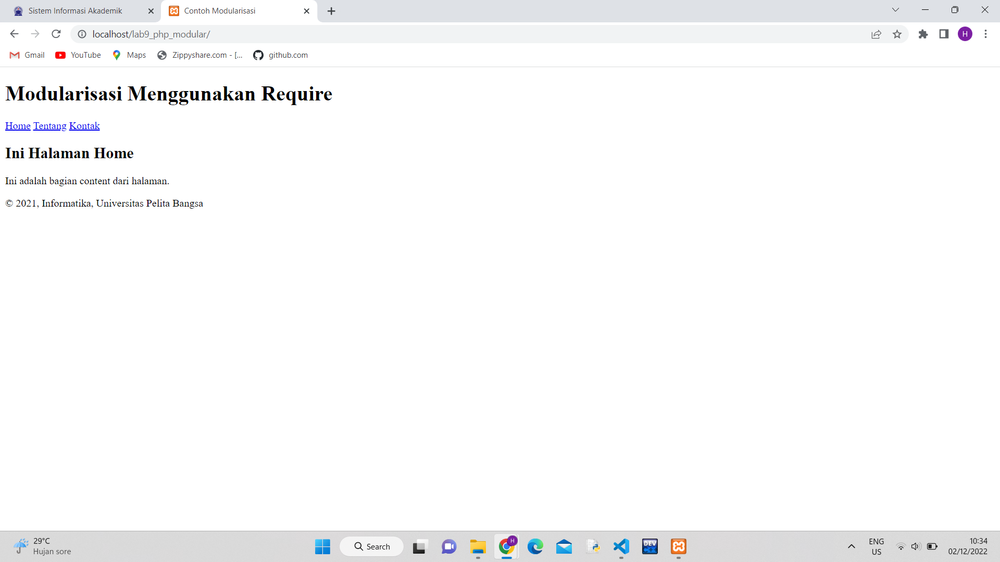<br>
'''

<b>Langkah-langkah praktikum</b>
<b>Tugas</b>

Membuat file baru dengan nama `header.php`
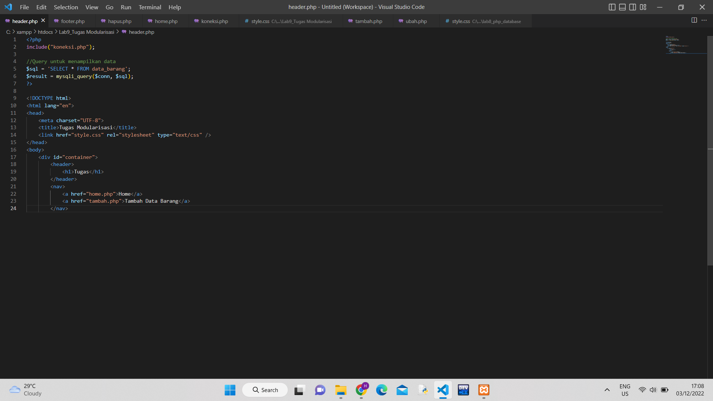<br>

Membuat file baru dengan nama `footer.php`
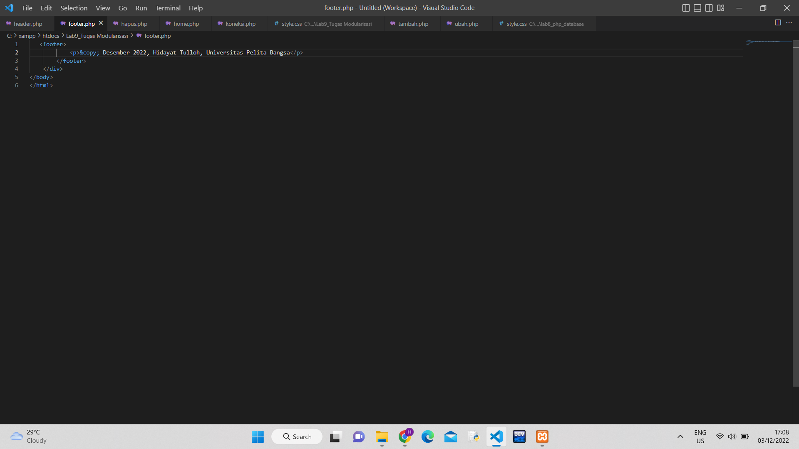<br>

Membuat file baru dengan nama `home.php`
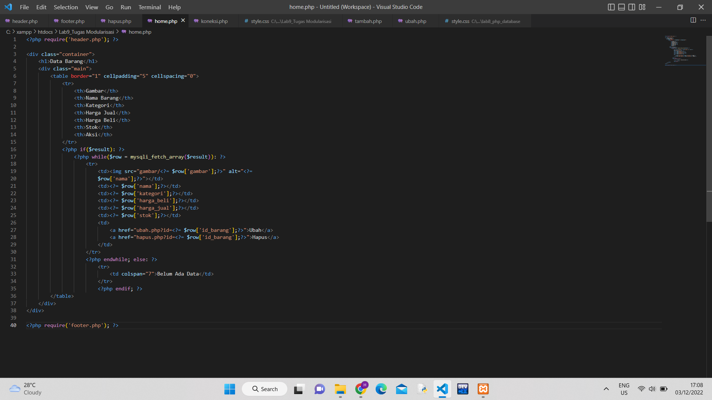<br>

Membuat file baru dengan nama `tambah.php`
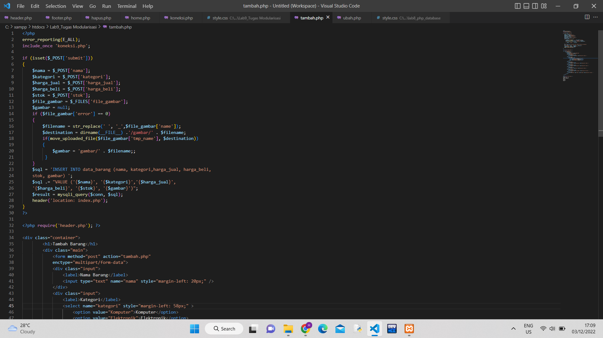<br>

Membuat file baru dengan nama `ubah.php`
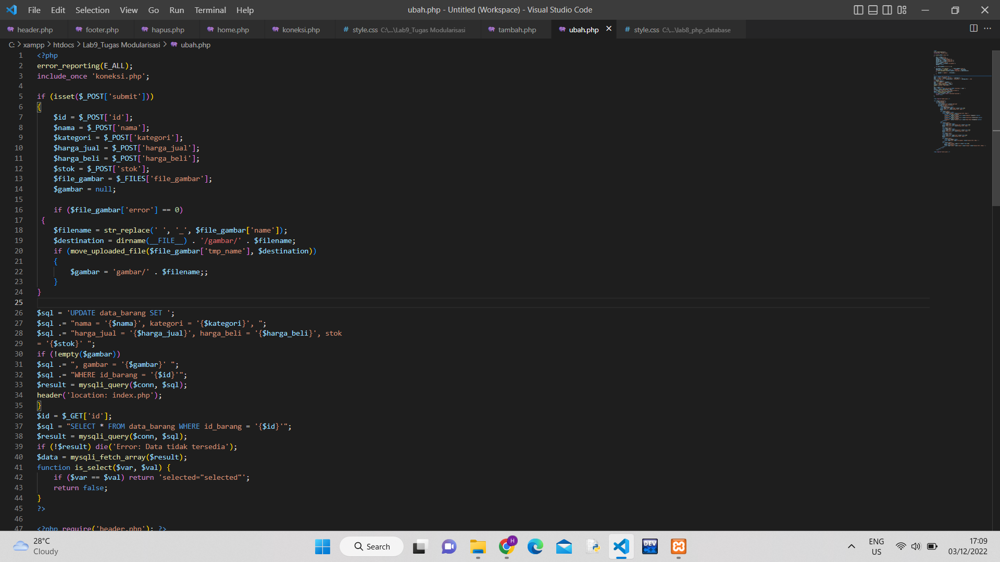<br>

Membuat file baru dengan nama `hapus.php`
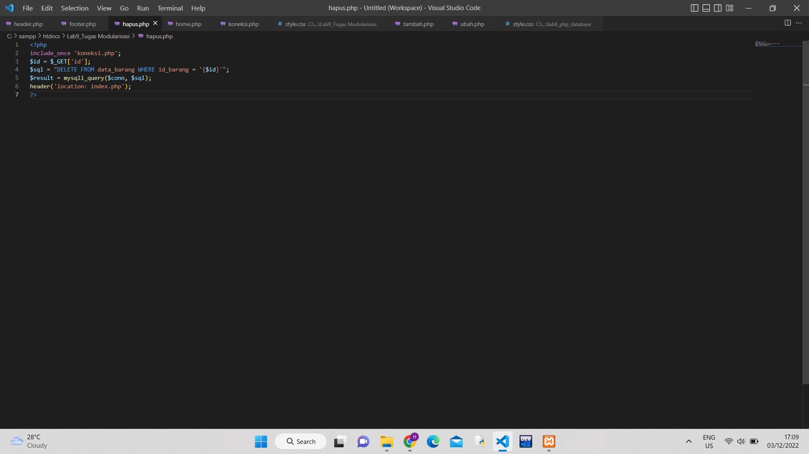<br>

Membuat file baru dengan nama `style.css`
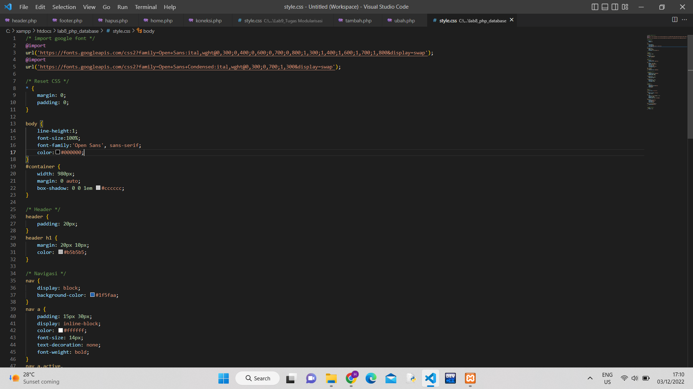<br>

Hasilnya :<br>
Tampilan Home
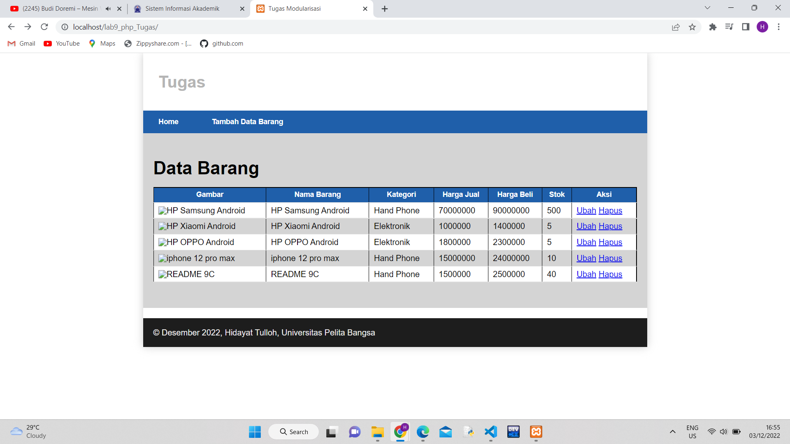<br>

Tampilan Tambah Data Barang
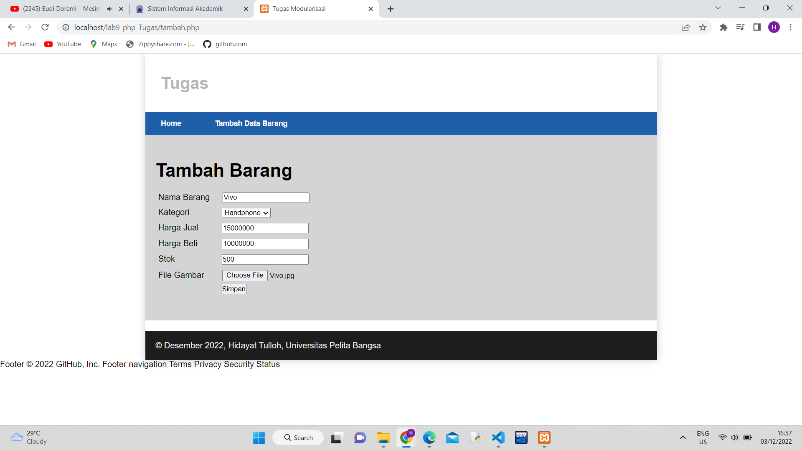<br>

Tampilan Hasil nya Tugas barangnya
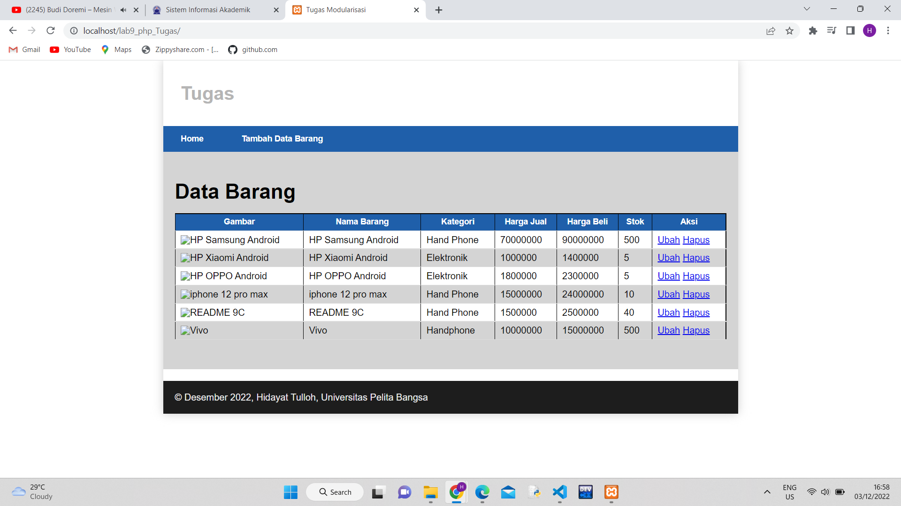<br>